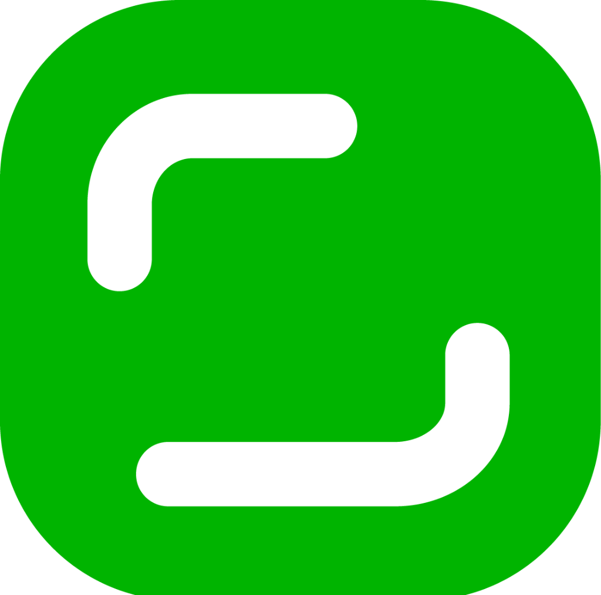

<div align="center">



# KLYPIX

### Every project gets a brain. Not a *second* brain — a **shared** one.

**A portable project workspace with a shared brain — for you *and* your AI agents.**

*One project. One shared understanding.*  ·  Windows · English & العربية

**[⬇ Download for Windows](https://github.com/dahshanlabs/KLYPIX/releases/latest)** · [klypix.com](https://klypix.com) · auto-updating

</div>

---

KLYPIX is a Windows workspace built around one idea: your project's memory should be a place you and your AI agents work in **together, at the same time** — not a folder an AI writes reports into while you watch.

One keystroke opens it over anything on your screen. One file — `brain.klypix` — holds what your project knows.

## The loop

Everything in KLYPIX feeds one cycle:

1. **Capture anything** — one keystroke summons the assistant over whatever you're doing; it already sees your screen, your active window, the page you're reading, the files you have open. Ask, extract, generate real documents (DOCX/XLSX/PPTX/PDF). A command palette searches apps, files, clipboard history, and AI commands from anywhere; an AI quick action runs translate / improve / summarize on whatever text you've selected — in any app; Deep Mode reads across the documents you have open and answers against all of them.
2. **Organize in space** — a canvas where cards, files, images, folders, and code live *with their bytes inside*. Position is meaning: containers are areas, arrows are reasons, 📌 Focus is an instruction.
3. **Act with agents** — a multi-model agent (Claude / Gemini / GPT / GLM / DeepSeek) that uses your screen, files, browser, and a Linux sandbox — under a permission system you control, with an enforced daily budget.
4. **It all lands in the brain** 🧠 — decisions, corrections, open questions, skills. The next session (yours or an agent's) starts already knowing them.

## The room, not the aquarium

You've seen the demos: an AI fills a graph of notes while the human watches. Even that pattern's inventor says it — *"you never write the wiki yourself."* In KLYPIX, you work **inside** the memory while it forms: your cursor typing in one card while agent decisions land beside your hands — each in its area, with an arrow explaining why. And the save is merge-verified: it refuses to write a file that lost a card.

The brain 🧠 also isn't a passive notebook:

- **It argues back** — propose something the project already reversed and it answers with the receipt, including *which agent* wrote the correction.
- **It knows when it's stale** — decisions can anchor to the exact code they were made against, and raise a hand in the next brief when that code moves on.
- **It remembers what it used to believe** — ask *as of March* and corrections from the future don't leak backwards.

## One file you can hold

The whole brain — layout, decisions, arrows, and the actual **bytes** (images, PDFs, audio, code, whole folders) — lives inside a single `.klypix` file. Not shortcuts pointing at files on your disk: the contents travel *in* the file. Git it, email it, hand it to an agent, and everything arrives with it.

Not a cage: **Obsidian `.canvas` files open directly**, and everything **exports to Markdown and JSON Canvas** in one click. The format is open — spec and open-source tooling at [dahshanlabs/klypix-mcp](https://github.com/dahshanlabs/klypix-mcp).

## Two people, one brain

The brain is a file in your repo, so a team already shares it the way they share code — clone,
branch, pull. One command per clone makes that safe:

```bash
npx klypix-mcp git-driver install
```

Git stops treating `brain.klypix` as an opaque binary and hands merges to the KLYPIX engine:
new cards from both sides survive, and a card edited on both sides keeps **both** versions —
the second as a linked twin, rather than one silently winning. A machine that skipped the command
just gets the normal conflict: safe degradation, not corruption.

The brain can also speak in review:

```bash
npx klypix-mcp diff main             # what changed, card by card
npx klypix-mcp pr-brief origin/main  # decisions already recorded about this PR's files
```

Both print markdown. [`examples/github/brain-pr.yml`](https://github.com/dahshanlabs/klypix-mcp/blob/master/examples/github/brain-pr.yml)
wires them into a pull-request comment using only your checkout and the default `GITHUB_TOKEN`.

## The everyday layer

The loop is fed by launcher-grade tools that live one keystroke away, system-wide:

- **Command palette** — search apps, files, clipboard history, and AI commands from anywhere.
- **AI quick action** — select text in any app, one keystroke: translate, improve, summarize.
- **Clipboard history** — everything you copy, searchable, ready to land on a canvas.
- **Deep Mode** — pick the documents you have open; the assistant answers against all of them at once.
- **Voice** — dictate instead of typing, and optionally have replies read back.

## The brain is free. The home is KLYPIX.

- **Free** — the brain engine, the MCP server, the hooks, the format: open source (Apache-2.0), local-first, works with your own API keys, offline. `npx klypix-mcp install` gives every repo on your machine a brain, no app required.
- **KLYPIX** — the Windows workspace where you *live* in it: see the brain as a spatial map, work in it while agents write, capture from anywhere, act with agents, share encrypted. Bilingual English/Arabic.

## Install

Grab the installer from [Releases](https://github.com/dahshanlabs/KLYPIX/releases/latest) (Windows 10/11 x64). The app updates itself via staged rollout from this repo.

## Honest notes

- Windows-only today.
- This repository hosts releases; the application source is proprietary. The brain — format, server, hooks — is fully open at [dahshanlabs/klypix-mcp](https://github.com/dahshanlabs/klypix-mcp).
- A canvas only reaches the cloud when you share it, and it is encrypted on your device before upload. Not a blanket end-to-end claim: the canvas title is stored unencrypted, the live edit log is stored readable, and for email-invited collaborators the server holds the key. Everything else stays on your machine.

---

<div align="center">

© Dahshan Labs · [klypix.com](https://klypix.com) · the open brain: [klypix-mcp](https://github.com/dahshanlabs/klypix-mcp)

</div>
